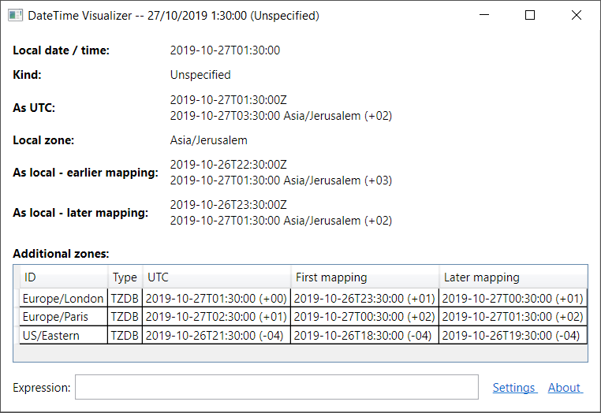
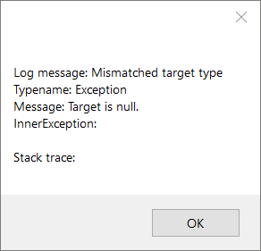

# DateTimeVisualizer

  

A .NET `DateTime` value can potentially have multiple ambiguous meanings.

* `DateTime` has no inherent timezone information associated with it, aside from the timezone determined (or not determined) by the `DateTime.Kind` property:
  - UTC (`DateTimeKind.Utc`)
  - local to the system (`DateTimeKind.Local`)
  - up for grabs (`DateTimeKind.Unspecified`)
  
  The same `DateTime` could refer to different instants in time in different timezones.
* For a given timezone, time cannot be expressed as a linear sequence of `DateTime`s -- there may be gaps (when the clock moves forward), or there may be places where the sequence doubles back (when the clock moves back). The combination of a `DateTime` and a time zone may refer to 1, 0 or 2 instants in time.

This project provides a custom debugging visualizer that maps out these possible instants for a given `DateTime`, using the NodaTime library. In addition, you can choose a list of timezones to apply to each of those possible instants.

* **As UTC**: If the date/time is interpreted as UTC, it will refer to this instant. Because date/times in UTC are always in linear succession, this instant is unambiguous.
* **Local zone**: The local timezone for the debuggee process.
* **As local -- earlier / later mapping**: If the datetime is interpreted as local (to the system), it may refer to 1 instant (earlier mapping), 2 instants (earlier or later mapping), or 0 instants.
* **Additional zones**: You can choose from

## Usage

Choose **DateTime Visualizer** from the magnifying glass dropdown while in a Visual Studio debugging session. If there is only one entry, or you've previously chosen it, you can click directly on the magnifying glass.

> **Note**  
> If the type of the target expression is `DateTime`:
>
>     var dte = new DateTime(2001, 1, 1, 1, 1, 1, DateTimeKind.Unspecified);
> the visualizer API will not pass the `DateTime` across to the debuggee side ([#7](https://github.com/zspitz/DateTimeVisualizer/issues/7)), and you'll see a message like this:
>
> 
>
> You can workaround this by opening the visualizer on a boxed expression:
>
>     (object)dte

The UI components (views and viewmodels) are also available as a [NuGet package](https://www.nuget.org/packages/DateTimeVisualizer.UI/) for use in your own applications.

## Requirements / Supports

The visualizer provides two versions: one for VS 2019, and one for VS 2017. Theoretically, the 2017 version should also work with earlier versions of VS.

The visualizer can be used with a project targeting .NET Framework 4.5+, or .NET Standard 2.0 (which includes .NET Core 2.0+).

## Installation

From the [project's Releases page](https://github.com/zspitz/DateTimeVisualizer/releases), download the ZIP file corresponding to your Visual Studio version (2019 or 2017). Then:

1. Unblock the ZIP file
2. Extract the files to the visualizers folder, preserving the [required folder structure](https://docs.microsoft.com/en-us/visualstudio/debugger/how-to-install-a-visualizer?view=vs-2019#to-install-a-visualizer-for-visual-studio-2019).

## Uninstallation

To delete the visualizer:

1. Navigate to the visualizer location. This can be done by clicking on the **About** link, and then clicking on the **DateTimeVisualizer.dll** link.
2. Delete all files and folders whose name starts with `DateTimeVisualizer`. You can find these by typing `name:DateTimeVisualizer` in the Windows search box.

## Build

The project makes use of submodules, so you need to clone or pull changes into the repo using `--recurse-submodules`, as described [in the Git documentation](https://git-scm.com/book/en/v2/Git-Tools-Submodules#_cloning_submodules).

## Contributing / Feedback

* Provide feedback to Microsoft about [these limitations/issues with the visualizer API](https://github.com/zspitz/ExpressionToString/wiki/External-issues)
* Test the visualizer.
* Suggest ideas and enhancements (via [issues](https://github.com/zspitz/DateTimeVisualizer/issues/new/choose))
* Notify about bugs (via [issues](https://github.com/zspitz/DateTimeVisualizer/issues/new/choose))
* Star the project
* Spread the word

## Credits

* The [NodaTime](https://nodatime.org/) project
* John M. Wright's series on [writing debugger visualizers](https://wrightfully.com/writing-a-readonly-debugger-visualizer)
* [Greenshot](https://getgreenshot.org/) for the screenshots
